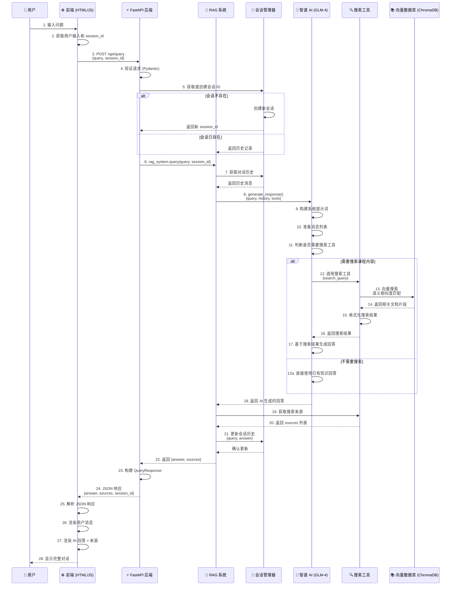
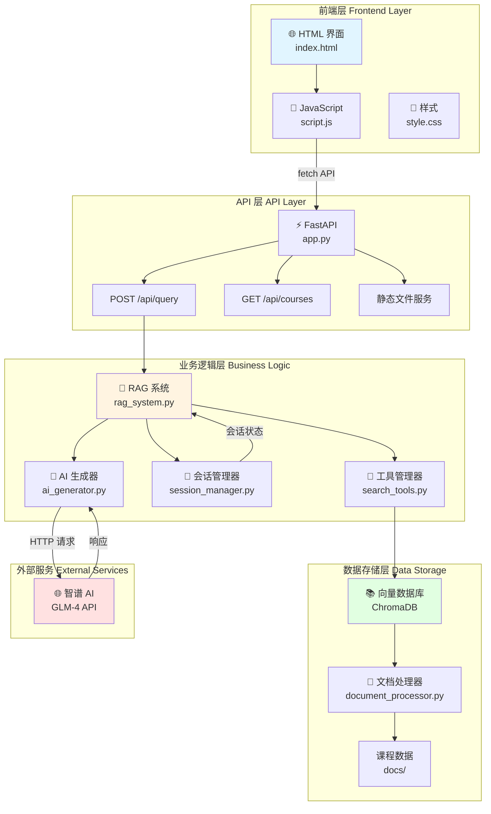
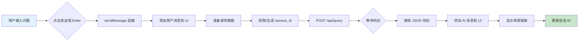
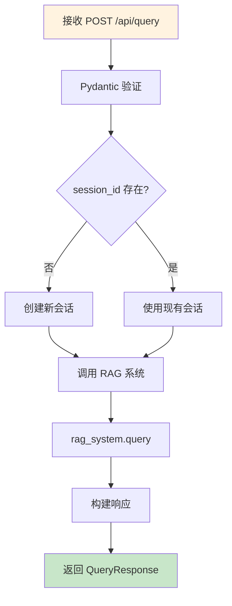
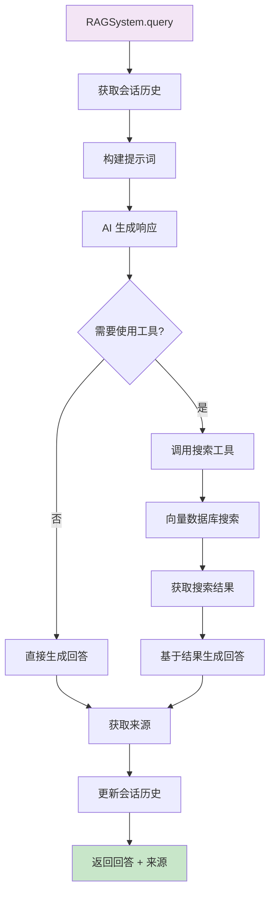
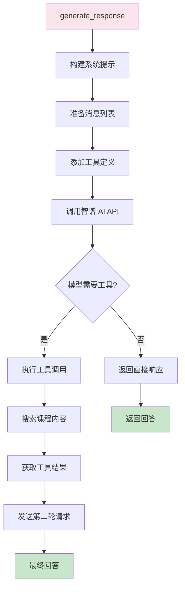

# RAG 聊天机器人数据流程图

## 系统架构流程图



## 组件架构图



## 数据处理流程详解

### 1️⃣ 前端处理流程



**关键代码位置**：
- `frontend/index.html:59-66` - 输入框和发送按钮
- `frontend/script.js:48-95` - sendMessage 函数

### 2️⃣ 后端 API 处理流程



**关键代码位置**：
- `backend/app.py:56-74` - query_documents 函数
- `backend/models.py:7-12` - QueryRequest 模型
- `backend/models.py:15-20` - QueryResponse 模型

### 3️⃣ RAG 系统核心流程



**关键代码位置**：
- `backend/rag_system.py:102-140` - query 方法
- `backend/ai_generator.py:43-94` - generate_response 方法
- `backend/search_tools.py:30-65` - CourseSearchTool.execute

### 4️⃣ AI 生成器工作流程



**关键代码位置**：
- `backend/ai_generator.py:43-94` - generate_response
- `backend/ai_generator.py:111-169` - _handle_tool_execution
- `backend/ai_generator.py:96-109` - _convert_tools_to_zhipu_format

## 技术栈总结

### 前端技术栈
- **HTML5** - 页面结构
- **CSS3** - 样式设计
- **Vanilla JavaScript** - 交互逻辑（无框架）
- **Fetch API** - HTTP 请求

### 后端技术栈
- **Python 3.13** - 编程语言
- **FastAPI** - Web 框架
- **Pydantic** - 数据验证
- **Uvicorn** - ASGI 服务器

### AI 和数据技术栈
- **智谱 AI (ZhipuAI)** - GLM-4 语言模型
- **ChromaDB** - 向量数据库
- **Sentence Transformers** - 文本嵌入模型 (all-MiniLM-L6-v2)
- **Python-dotenv** - 环境变量管理

## 关键文件索引

| 文件路径 | 功能描述 | 关键函数/类 |
|---------|---------|-----------|
| `frontend/index.html` | 前端主页面 | UI 结构 |
| `frontend/script.js` | 前端逻辑 | sendMessage() |
| `backend/app.py` | API 主入口 | query_documents() |
| `backend/rag_system.py` | RAG 核心系统 | RAGSystem.query() |
| `backend/ai_generator.py` | AI 生成器 | AIGenerator.generate_response() |
| `backend/search_tools.py` | 搜索工具 | CourseSearchTool.execute() |
| `backend/vector_store.py` | 向量存储 | VectorStore.search() |
| `backend/session_manager.py` | 会话管理 | SessionManager |
| `backend/config.py` | 配置管理 | Config 数据类 |
| `.env` | 环境变量 | ZHIPU_API_KEY |

## API 端点规范

### POST /api/query
**请求**：
```json
{
  "query": "用户的问题",
  "session_id": "可选的会话ID"
}
```

**响应**：
```json
{
  "answer": "AI 的回答",
  "sources": ["来源1", "来源2"],
  "session_id": "会话ID"
}
```

### GET /api/courses
**响应**：
```json
{
  "total_courses": 5,
  "course_titles": ["课程1", "课程2"]
}
```

## 性能优化要点

1. **会话管理** - 维护对话上下文，避免重复发送历史
2. **向量搜索** - 语义搜索提高相关性
3. **工具调用** - 智能决策何时搜索，减少不必要的 API 调用
4. **异步处理** - FastAPI 异步支持提高并发性能
