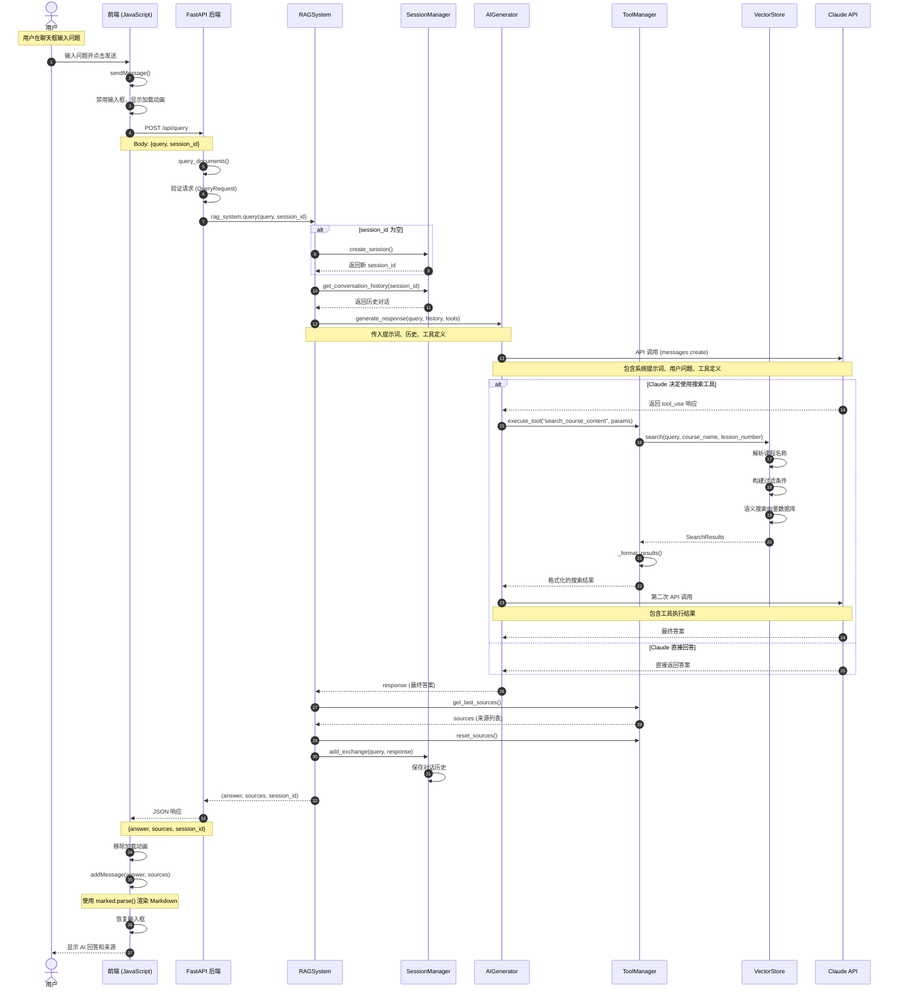
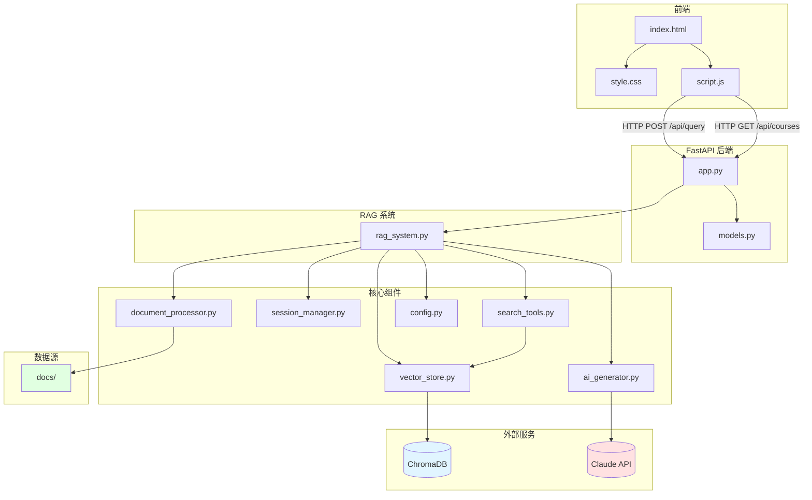

# RAG 聊天机器人请求流程文档

## 项目概述

这是一个基于 RAG (Retrieval-Augmented Generation) 的课程材料问答系统，采用前后端分离架构：

- **前端**: 原生 HTML/CSS/JavaScript
- **后端**: Python FastAPI
- **向量存储**: ChromaDB
- **AI 模型**: Anthropic Claude
- **嵌入模型**: Sentence Transformers

---

## 完整请求流程图



---

## 详细流程说明

### 第一步：用户输入 (前端)

**文件位置**: `frontend/script.js:45-96`

```javascript
async function sendMessage() {
    const query = chatInput.value.trim();  // 获取用户输入
    if (!query) return;

    // 禁用输入防止重复提交
    chatInput.value = '';
    chatInput.disabled = true;
    sendButton.disabled = true;

    // 添加用户消息到界面
    addMessage(query, 'user');

    // 创建加载动画
    const loadingMessage = createLoadingMessage();
    chatMessages.appendChild(loadingMessage);

    try {
        // 发送 API 请求
        const response = await fetch(`${API_URL}/query`, {
            method: 'POST',
            headers: {
                'Content-Type': 'application/json',
            },
            body: JSON.stringify({
                query: query,
                session_id: currentSessionId
            })
        });

        if (!response.ok) throw new Error('Query failed');

        const data = await response.json();

        // 更新会话 ID
        if (!currentSessionId) {
            currentSessionId = data.session_id;
        }

        // 显示 AI 回答
        loadingMessage.remove();
        addMessage(data.answer, 'assistant', data.sources);

    } catch (error) {
        loadingMessage.remove();
        addMessage(`Error: ${error.message}`, 'assistant');
    } finally {
        chatInput.disabled = false;
        sendButton.disabled = false;
        chatInput.focus();
    }
}
```

**关键点**:
- API_URL = '/api' (相对路径)
- 请求体包含 `query` 和可选的 `session_id`
- 使用 `marked.parse()` 将 Markdown 渲染为 HTML

---

### 第二步：API 接收 (后端)

**文件位置**: `backend/app.py:56-74`

```python
@appapp.post("/api/query", response_model=QueryResponse)
async def query_documents(request: QueryRequest):
    """处理查询并返回带来源的响应"""
    try:
        # 如果没有提供 session_id，创建新会话
        session_id = request.session_id
        if not session_id:
            session_id = rag_system.session_manager.create_session()

        # 使用 RAG 系统处理查询
        answer, sources = rag_system.query(request.query, session_id)

        return QueryResponse(
            answer=answer,
            sources=sources,
            session_id=session_id
        )
    except Exception as e:
        raise HTTPException(status_code=500, detail=str(e))
```

**请求模型** (`backend/app.py:38-42`):
```python
class QueryRequest(BaseModel):
    query: str
    session_id: Optional[str] = None
```

**响应模型** (`backend/app.py:43-47`):
```python
class QueryResponse(BaseModel):
    answer: str
    sources: List[str]
    session_id: str
```

---

### 第三步：RAG 系统处理

**文件位置**: `backend/rag_system.py:102-140`

```python
def query(self, query: str, session_id: Optional[str] = None) -> Tuple[str, List[str]]:
    """使用 RAG 系统处理用户查询"""

    # 创建 AI 提示词
    prompt = f"""Answer this question about course materials: {query}"""

    # 获取对话历史
    history = None
    if session_id:
        history = self.session_manager.get_conversation_history(session_id)

    # 使用工具生成响应
    response = self.ai_generator.generate_response(
        query=prompt,
        conversation_history=history,
        tools=self.tool_manager.get_tool_definitions(),
        tool_manager=self.tool_manager
    )

    # 从搜索工具获取来源
    sources = self.tool_manager.get_last_sources()
    self.tool_manager.reset_sources()

    # 更新对话历史
    if session_id:
        self.session_manager.add_exchange(session_id, query, response)

    return response, sources
```

---

### 第四步：AI 生成器处理

**文件位置**: `backend/ai_generator.py:43-87`

```python
def generate_response(self, query: str,
                     conversation_history: Optional[str] = None,
                     tools: Optional[List] = None,
                     tool_manager=None) -> str:
    """生成 AI 响应，支持工具使用和对话上下文"""

    # 构建系统提示词
    system_content = (
        f"{self.SYSTEM_PROMPT}\n\nPrevious conversation:\n{conversation_history}"
        if conversation_history
        else self.SYSTEM_PROMPT
    )

    # 准备 API 参数
    api_params = {
        "model": self.model,
        "temperature": 0,
        "max_tokens": 800,
        "messages": [{"role": "user", "content": query}],
        "system": system_content
    }

    # 添加工具定义
    if tools:
        api_params["tools"] = tools
        api_params["tool_choice"] = {"type": "auto"}

    # 调用 Claude API
    response = self.client.messages.create(**api_params)

    # 如果需要执行工具
    if response.stop_reason == "tool_use" and tool_manager:
        return self._handle_tool_execution(response, api_params, tool_manager)

    # 返回直接响应
    return response.content[0].text
```

**系统提示词** (`backend/ai_generator.py:8-30`):
```
You are an AI assistant specialized in course materials...

Search Tool Usage:
- Use the search tool only for questions about specific course content
- One search per query maximum
- Synthesize search results into accurate, fact-based responses

Response Protocol:
- General knowledge questions: Answer without searching
- Course-specific questions: Search first, then answer
- No meta-commentary
```

---

### 第五步：工具执行（如果 Claude 决定使用）

**文件位置**: `backend/ai_generator.py:89-135`

```python
def _handle_tool_execution(self, initial_response, base_params, tool_manager):
    """处理工具调用并获取最终响应"""

    messages = base_params["messages"].copy()

    # 添加 AI 的工具使用响应
    messages.append({"role": "assistant", "content": initial_response.content})

    # 执行所有工具调用
    tool_results = []
    for content_block in initial_response.content:
        if content_block.type == "tool_use":
            tool_result = tool_manager.execute_tool(
                content_block.name,
                **content_block.input
            )

            tool_results.append({
                "type": "tool_result",
                "tool_use_id": content_block.id,
                "content": tool_result
            })

    # 添加工具结果
    if tool_results:
        messages.append({"role": "user", "content": tool_results})

    # 获取最终响应
    final_response = self.client.messages.create(
        **base_params,
        messages=messages
    )
    return final_response.content[0].text
```

---

### 第六步：搜索工具执行

**文件位置**: `backend/search_tools.py:52-86`

```python
def execute(self, query: str, course_name: Optional[str] = None,
            lesson_number: Optional[int] = None) -> str:
    """执行搜索工具"""

    # 调用向量存储的搜索接口
    results = self.store.search(
        query=query,
        course_name=course_name,
        lesson_number=lesson_number
    )

    # 处理错误
    if results.error:
        return results.error

    # 处理空结果
    if results.is_empty():
        filter_info = ""
        if course_name:
            filter_info += f" in course '{course_name}'"
        if lesson_number:
            filter_info += f" in lesson {lesson_number}"
        return f"No relevant content found{filter_info}."

    # 格式化并返回结果
    return self._format_results(results)
```

**工具定义** (`backend/search_tools.py:27-50`):
```python
def get_tool_definition(self) -> Dict[str, Any]:
    return {
        "name": "search_course_content",
        "description": "Search course materials with smart course name matching",
        "input_schema": {
            "type": "object",
            "properties": {
                "query": {
                    "type": "string",
                    "description": "What to search for in the course content"
                },
                "course_name": {
                    "type": "string",
                    "description": "Course title (partial matches work)"
                },
                "lesson_number": {
                    "type": "integer",
                    "description": "Specific lesson number to search within"
                }
            },
            "required": ["query"]
        }
    }
```

---

### 第七步：向量存储搜索

**文件位置**: `backend/vector_store.py:61-100`

```python
def search(self,
           query: str,
           course_name: Optional[str] = None,
           lesson_number: Optional[int] = None,
           limit: Optional[int] = None) -> SearchResults:
    """主搜索接口"""

    # 步骤 1: 解析课程名称
    course_title = None
    if course_name:
        course_title = self._resolve_course_name(course_name)
        if not course_title:
            return SearchResults.empty(f"No course found matching '{course_name}'")

    # 步骤 2: 构建过滤条件
    filter_dict = self._build_filter(course_title, lesson_number)

    # 步骤 3: 搜索课程内容
    search_limit = limit if limit is not None else self.max_results

    try:
        results = self.course_content.query(
            query_texts=[query],
            n_results=search_limit,
            where=filter_dict
        )
        return SearchResults.from_chroma(results)
    except Exception as e:
        return SearchResults.empty(f"Search error: {str(e)}")
```

**向量存储架构**:
- 使用 ChromaDB 作为向量数据库
- 两个集合 (Collection):
  - `course_catalog`: 存储课程元数据（标题、讲师、课程列表）
  - `course_content`: 存储课程内容分块
- 嵌入模型: Sentence Transformers
- 语义搜索支持课程名称模糊匹配

---

### 第八步：结果格式化

**文件位置**: `backend/search_tools.py:88-114`

```python
def _format_results(self, results: SearchResults) -> str:
    """格式化搜索结果，包含课程和课程上下文"""
    formatted = []
    sources = []  # 跟踪来源

    for doc, meta in zip(results.documents, results.metadata):
        course_title = meta.get('course_title', 'unknown')
        lesson_num = meta.get('lesson_number')

        # 构建上下文标题
        header = f"[{course_title}"
        if lesson_num is not None:
            header += f" - Lesson {lesson_num}"
        header += "]"

        # 跟踪来源
        source = course_title
        if lesson_num is not None:
            source += f" - Lesson {lesson_num}"
        sources.append(source)

        formatted.append(f"{header}\n{doc}")

    # 存储来源供后续检索
    self.last_sources = sources

    return "\n\n".join(formatted)
```

---

### 第九步：返回响应到前端

**文件位置**: `frontend/script.js:113-138`

```javascript
function addMessage(content, type, sources = null, isWelcome = false) {
    const messageId = Date.now();
    const messageDiv = document.createElement('div');
    messageDiv.className = `message ${type}`;

    // 将 Markdown 转换为 HTML
    const displayContent = type === 'assistant' ? marked.parse(content) : escapeHtml(content);

    let html = `<div class="message-content">${displayContent}</div>`;

    // 添加来源折叠框
    if (sources && sources.length > 0) {
        html += `
            <details class="sources-collapsible">
                <summary class="sources-header">Sources</summary>
                <div class="sources-content">${sources.join(', ')}</div>
            </details>
        `;
    }

    messageDiv.innerHTML = html;
    chatMessages.appendChild(messageDiv);
    chatMessages.scrollTop = chatMessages.scrollHeight;

    return messageId;
}
```

---

## 系统组件架构图



---

## API 端点总结

### 1. POST /api/query

**功能**: 处理用户查询请求

**请求体**:
```json
{
  "query": "What is MCP?",
  "session_id": "optional-session-id"
}
```

**响应**:
```json
{
  "answer": "MCP (Model Context Protocol) is...",
  "sources": ["Introduction to MCP - Lesson 1", "Advanced MCP - Lesson 3"],
  "session_id": "session-uuid"
}
```

### 2. GET /api/courses

**功能**: 获取课程统计信息

**响应**:
```json
{
  "total_courses": 4,
  "course_titles": [
    "Introduction to MCP",
    "Advanced Python",
    "FastAPI Basics",
    "Vector Databases"
  ]
}
```

---

## 会话管理

**文件位置**: `backend/session_manager.py`

- 使用内存存储会话历史
- 每个会话维护对话历史列表
- 支持配置最大历史长度 (`MAX_HISTORY`)
- 在每次查询后将问题和答案添加到历史

---

## 关键技术点

1. **RAG 架构**: 结合检索和生成，提供基于文档的准确答案
2. **工具调用**: Claude AI 可以自主决定是否使用搜索工具
3. **向量搜索**: 使用语义搜索而非关键词匹配
4. **会话上下文**: 支持多轮对话，维护对话历史
5. **来源追溯**: 返回答案来源，提高可信度

---

## 文件索引

| 文件 | 功能 | 关键函数/类 |
|------|------|------------|
| `frontend/index.html` | 主页面结构 | HTML DOM |
| `frontend/style.css` | 样式定义 | CSS 样式 |
| `frontend/script.js` | 前端逻辑 | `sendMessage()`, `addMessage()` |
| `backend/app.py` | FastAPI 应用 | `query_documents()`, `get_course_stats()` |
| `backend/rag_system.py` | RAG 核心逻辑 | `RAGSystem.query()` |
| `backend/ai_generator.py` | Claude API 交互 | `AIGenerator.generate_response()` |
| `backend/vector_store.py` | 向量数据库 | `VectorStore.search()` |
| `backend/search_tools.py` | 搜索工具 | `CourseSearchTool.execute()` |
| `backend/session_manager.py` | 会话管理 | `SessionManager` |
| `backend/document_processor.py` | 文档处理 | `DocumentProcessor` |
| `backend/models.py` | 数据模型 | `Course`, `Lesson`, `CourseChunk` |
| `backend/config.py` | 配置管理 | `config` |

---

## 数据流总结

```
用户输入
  ↓
前端 JavaScript (fetch API)
  ↓
FastAPI /api/query 端点
  ↓
RAGSystem.query()
  ↓
AIGenerator.generate_response() + 工具定义
  ↓
Claude API (第一轮调用)
  ↓
[工具使用] → ToolManager.execute_tool()
  ↓
CourseSearchTool.execute()
  ↓
VectorStore.search() (语义搜索)
  ↓
ChromaDB 向量数据库
  ↓
格式化搜索结果
  ↓
Claude API (第二轮调用，包含工具结果)
  ↓
最终答案
  ↓
RAGSystem (添加对话历史)
  ↓
FastAPI JSON 响应
  ↓
前端显示 (Markdown 渲染)
```

---

*文档生成时间: 2026-02-20*
